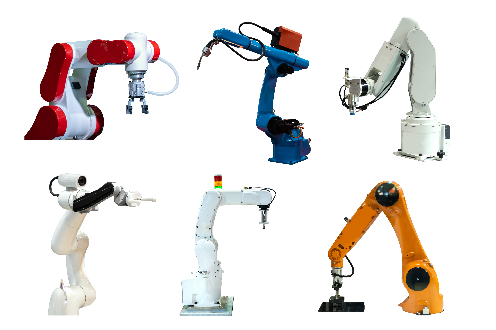

# Deep Control
## Deep Reinforcement Learning for Continuous Control


**Deep Control** is a pytorch implementation of deep reinforcement learning solutions to benchmark continuous control tasks.

So far, vanilla versions of [Deep Deterministic Policy Gradient](https://arxiv.org/pdf/1509.02971.pdf) and [Normalized Advantage Functions](https://arxiv.org/pdf/1603.00748.pdf) are included - both with a simplified version of [Hindsight Experience Replay](http://papers.nips.cc/paper/7090-hindsight-experience-replay).

Supported Environments:
- `Pendulum-v0`
- `MountainCarContinuous-v0`
- `Ant-v3`
- `Walker2d-v3`
- `Swimmer-v3`
- `Reacher-v2`
- `Hopper-v3`
- `Humanoid-v2`
- `HumanoidStandup-v2`
- `HalfCheetah-v3`
- `FetchPush-v1`
- `FetchReach-v1`
- `FetchSlide-v1`
- `FetchPickAndPlace-v1`
- `HandReach-v0`
- `HandManipulateBlockRotate-v0`
- `HandManipulateBlockRotateParall-v0`
- `HandManipulateBlockRotateXYZ-v0`
- `HandManipulateBlockFull-v0`
- `HandManipulateEgg-v0`
- `HandManipulateEggRotate-v0`
- `HandManipulateEggFull-v0`
- `HandManipulatePen-v0`
- `HandManipulatePenRotate-v0`
- `HandManipulatePenFull-v0`

### Installation
```bash
git clone https://github.com/jakegrigsby/deep_control.git
cd deep_control
pip install -e .
```

### Training
There are two main training scripts, `ddpg.py` and `naf.py`, which train a randomly initialized agent.

```bash
python -m deep_control.ddpg --env Ant-v3 --num_episodes 2000 --name my_ant_ddpg
```
In this case, the trained weights will be saved to `./saves/my_ant_ddpg_0`. The number on the end is automatically incremented to get a unique directory for each run.

The naf script is trained similarly, with `deep_control.naf` module. A complete list of command line arguments can be found at the bottom of each training script.

### Running a Pretrained Agent
```bash
python -m deep_control.run --agent saves/my_ant_ddpg --env Ant-v3 --render --episodes 100
```

### Run Tests
Install [pytest](https://docs.pytest.org/en/latest/)
```bash
pytest tests
```



### References
1) https://arxiv.org/pdf/1509.02971.pdf
2) https://arxiv.org/pdf/1603.00748.pdf`
3) http://papers.nips.cc/paper/7090-hindsight-experience-replay
4) https://github.com/ikostrikov/pytorch-ddpg-naf
5) https://github.com/keras-rl/keras-rl