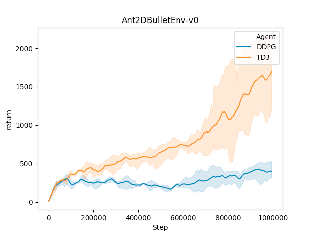
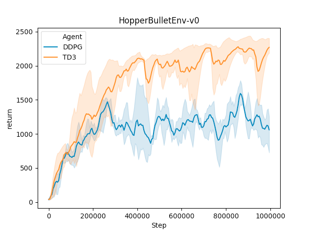
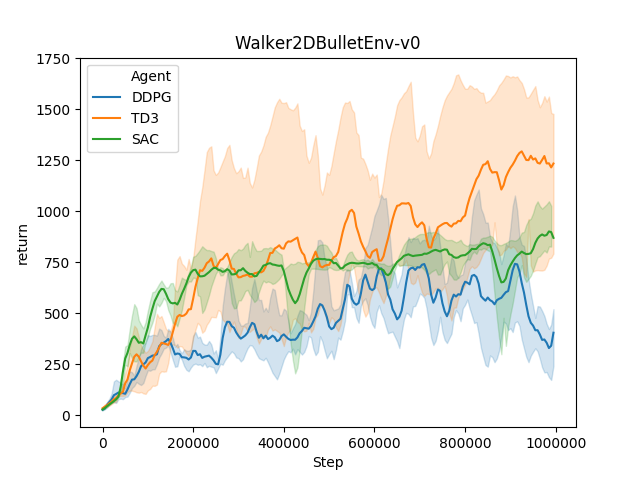

# Deep Control
## Simple single-worker pytorch implementations of deep RL algorithms for continuous control.

### Installation
```bash
git clone https://github.com/jakegrigsby/deep_control.git
cd deep_control
pip install -e .
```

### Training
There are three main training scripts, `ddpg.py`, `td3.py` and `sac.py`, which train a randomly initialized agent.

```bash
python -m deep_control.ddpg --env AntBulletEnv-v0 --num_episodes 2000 --name my_ant_ddpg
```
In this case, the trained weights will be saved to `./dc_saves/my_ant_ddpg_0`. The number on the end is automatically incremented to get a unique directory for each run.

### Benchmarking




More results will be added in the future
### Running a Pretrained Agent
```bash
python -m deep_control.run --agent saves/my_ant_ddpg --env AntBulletEnv-v0 --render --episodes 100
```

### Run Tests
Install [pytest](https://docs.pytest.org/en/latest/)
```bash
pytest tests
```

### References
1) https://arxiv.org/pdf/1509.02971.pdf
2) https://arxiv.org/pdf/1603.00748.pdf`
4) https://github.com/ikostrikov/pytorch-ddpg-naf
5) https://github.com/keras-rl/keras-rl
6) https://arxiv.org/abs/1802.09477
7) https://github.com/sfujim/TD3
8) https://spinningup.openai.com/
